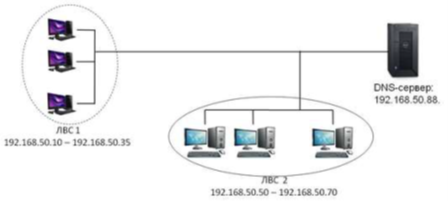
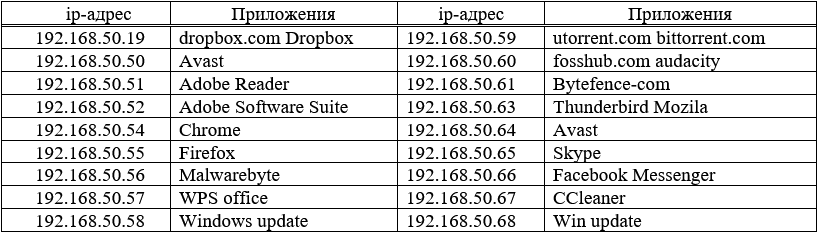
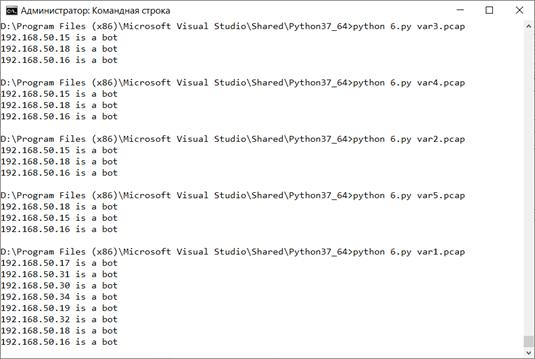

# bot-detector
Python pcap parser

Программа путем анализа параметров запросов и ответов DNS-сервера определяет инфицированные машины ЛВС №1.

ЛВС №1содержит компьютеры с адресами: 192.168.50.10 – 192.168.50.35. Некоторые из этих компьютеров инфицированы и являются ботами.
ЛВС №2 (192.168.50.50 – 192.168.50.70) содержит защищенные компьютеры, на которых
функционируют следующие легитимные приложения:

Компьютеры обеих сетей обращаются к своему DNS-серверу: 192.168.50.88. В каждом варианте содержатся записи запросов к веб-серверу и его ответы.

Для анализа DNS-запросов из файла захвата можно извлечь:
- IP-адрес хоста, посылающего DNS-запрос.
- Время DNS-запросов.
- Общее количество DNS-запросов, сделанных одним хостом.
Само по себе время не очень полезно, однако, при анализе множества запросов в некотором промежутке времени, можно определить закономерности, указывающие, что хост является ботом. 
Для такого набора данных был реализован следующий алгоритм:
1 Импорт пакетов из сохраненного файла захвата с фильтром «dns and ip.src != 192.168.50.88»
2 Для каждого хоста из подсети ЛВС №1 происходит формирование списка временных меток, для выполненных им запросов.
3 Далее в полученном на шаге 2 списке для каждого хоста проверяется количество отправленных запросов, и если оно не меньше 10, то:
4 Рассчитывается среднее значение для суммы интервалов времени между соседними запросами.
5 Вычисляется количество пар запросов, для которых значение интервала времени принадлежит промежутку среднее значение ±60 секунд.
6 Если количество запросов из шага b составляет 90% от общего числа запросов текущего хоста, то ip адрес хоста добавляется в список хостов-ботов.
7 Происходит вывод списка вредоносных хостов.
	
Результаты работы реализованного алгоритма:

